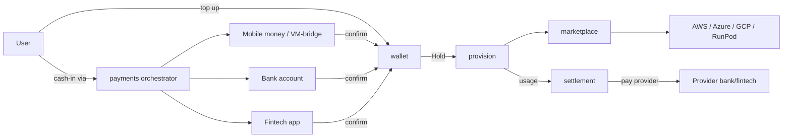

# GPU Cloud Platform — Backend (Go microservices)

A multi-rail GPU hosting platform. Users **top up** money through three
payment rails (carrier mobile-money behind a VM proxy bridge, a global bank
account, or a third-party fintech app); the platform then **sources GPU
compute from existing cloud providers** via adapters and **pays those
providers from its pooled bank/fintech account**.

Each responsibility lives in its own microservice (see `cmd/<service>`).
Go stdlib only — the whole thing builds and runs offline with simulated
adapters.

```
backend/
  cmd/<service>/main.go     one binary per microservice
  internal/<service>/…       service domain + handlers + adapters
  internal/shared/…          events, money, ids, http kit
  Dockerfile · docker-compose.yml · Makefile
```

## Services

| Service      | Port | Responsibility |
|--------------|------|----------------|
| identity     | 8081 | accounts (register) |
| wallet       | 8082 | balances, holds, immutable ledger |
| payments     | 8083 | top-up orchestration across payment rails |
| marketplace  | 8084 | GPU availability aggregation from cloud providers |
| provision    | 8085 | instance lifecycle (create/stop/destroy) |
| settlement   | 8086 | money-out: pays cloud providers from pooled bank account |
| notify       | 8088 | event/webhook ingestion |

## The two money/GPU loops



## Run

```
go build ./...
# or
make build
# containerized:
docker compose up --build
```

## Communication

Synchronous **REST** between services; state changes publish on an event
`Bus` (in-memory, or webhook POST `/events` between processes). A Kafka
transport ships behind the `kafka` build tag in
`internal/shared/events/kafka_bus.go` — wire it in after the payment + cloud
adapters are implemented (see its header comment).

Each service README documents its use cases, sequence, activity, deployment,
DB schema and ER diagram as Mermaid diagrams.