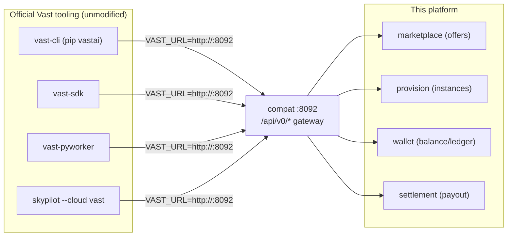
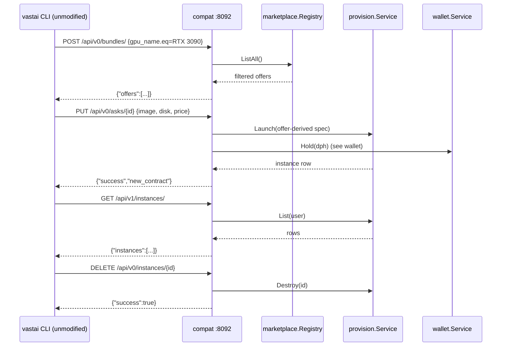

# compat — Vast.ai API compatibility gateway

`cmd/compat` exposes a REST gateway that mirrors the **console.vast.ai
`/api/v0`** surface so unmodified official Vast.ai tooling works against this
platform instead of Vast's cloud. The official SDK, CLI, PyWorker, and
SkyPilot's `vast` backend all speak this protocol over plain HTTP; pointing
them at this service (via `VAST_URL`) transparently reroutes them to our own
wallet, marketplace, provision, and settlement logic.

It deliberately aggregates the internal services **in-process** so one binary
serves the whole Vast-compatible surface on port 8092.

## Why a compat layer instead of re-using the REST microservices?

The microservices expose *our* verbs (`POST /offers`, `POST /instances`,
`GET /wallets/{id}`). Vast tooling calls *Vast's* verbs with Vast's payload
shapes and envelope: `POST /api/v0/bundles/` with `{"gpu_name": {"eq": ...}}`
filters, `PUT /api/v0/asks/{id}` to rent, `GET /api/v1/instances/` for
paginated instance rows, `GET /users/current` for balance, and JSON dicts
starting with `{"success": ...}`. The compat server translates between the
two so nothing upstream or downstream changes.



## Mapped surface

| Vast endpoint (official) | Our backing store |
|--------------------------|-------------------|
| `POST /api/v0/bundles/` (offer search) | `marketplace.Registry` |
| `PUT /api/v0/search/asks/` (new search) | `marketplace.Registry` |
| `GET /api/v0/template/` | static template catalog |
| `PUT /api/v0/asks/{id}` (create) | `provision.Service.Launch` |
| `POST /api/v0/asks/bulk` (create many) | `provision.Service.Launch` |
| `GET /api/v0/instances/` , `GET /api/v1/instances/` | `provision.Service.List` |
| `PUT /api/v0/instances` (start/stop) | `provision.Service.Update` |
| `DELETE /api/v0/instances/{id}` (destroy) | `provision.Service.Destroy` |
| `PUT /api/v0/instances/reboot/{id}` | `provision.Service.Update` |
| `GET /users/current`, `GET /api/v0/users/current` | `wallet.Service` |
| `GET /users/me/invoices`, `GET /api/v0/charges/` | `wallet.Service.Ledger` |
| `POST /api/v0/topup` (optional gift) | `wallet.Service.Credit` |
| `GET /api/v0/admin/stats` (this platform) | aggregates registry + provision + wallet |

## Auth

The SDK sends the API key as `Authorization: Bearer <key>` (header) **and**
many calls also embed `{"api_key": ...}` in the JSON body — see
`vastai/api/client.py`. `compat` accepts either, exactly like the real API.
The demo key defaults to `demo-api-key` (override with `COMPAT_API_KEY`).

## Try it for real

```bash
cd backend
go run ./cmd/compat        # compat gateway on :8092, key demo-api-key
```

Then in a second terminal with the *official* CLI installed:

```bash
pip install vastai
export VAST_URL="http://localhost:8092"
export VAST_API_KEY="demo-api-key"
vastai show user
vastai search offers 'gpu_name="RTX 3090"'
vastai create instance <offer-id> --image pytorch/pytorch:latest
vastai show instances
vastai destroy instance <id>
```

The same target environment variables (`VAST_URL`, `VAST_API_KEY`) work for
the Python SDK, PyWorker, and SkyPilot's vast backend.

## Sequence — rent an instance with the official CLI



## Conventions carried from the SDK source

- Every response is a JSON object; errors are `{"success": false, "msg": ...}`.
- Offer rows carry `gpu_name, gpu_ram, num_gpus, cpu_cores, cpu_ram,
  disk_space, dph_total, display_price, inet_down, inet_up, reliability2,
  score, verified, datacenter, rented, rentable`.
- The bundles search body **is** the filter dict (no `q` wrapper); the newer
  search endpoint wraps it (`{"q": {...}, "select_cols": [...]}`). Both are
  handled.
- Trailing slashes are normalized so `/asks/3/` and `/asks/3` resolve the same.

## Configuration

| Env | Default | Purpose |
|-----|---------|---------|
| `COMPAT_PORT` | 8092 | listen port |
| `COMPAT_API_KEY` | `demo-api-key` | key accepted by `authorized()` |
| `COMPAT_USER_ID` | `user-demo` | owner of every rented instance |