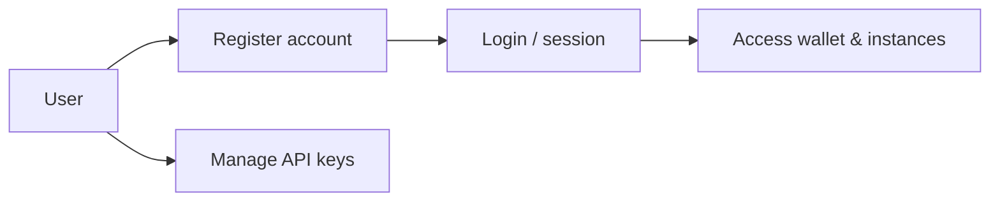
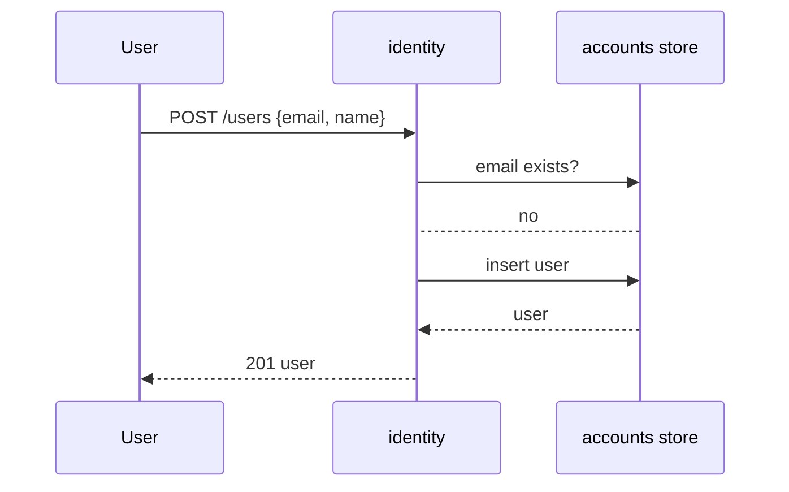
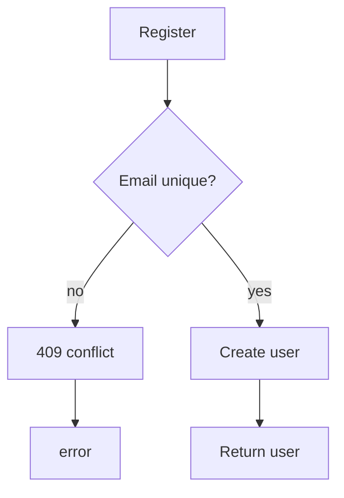
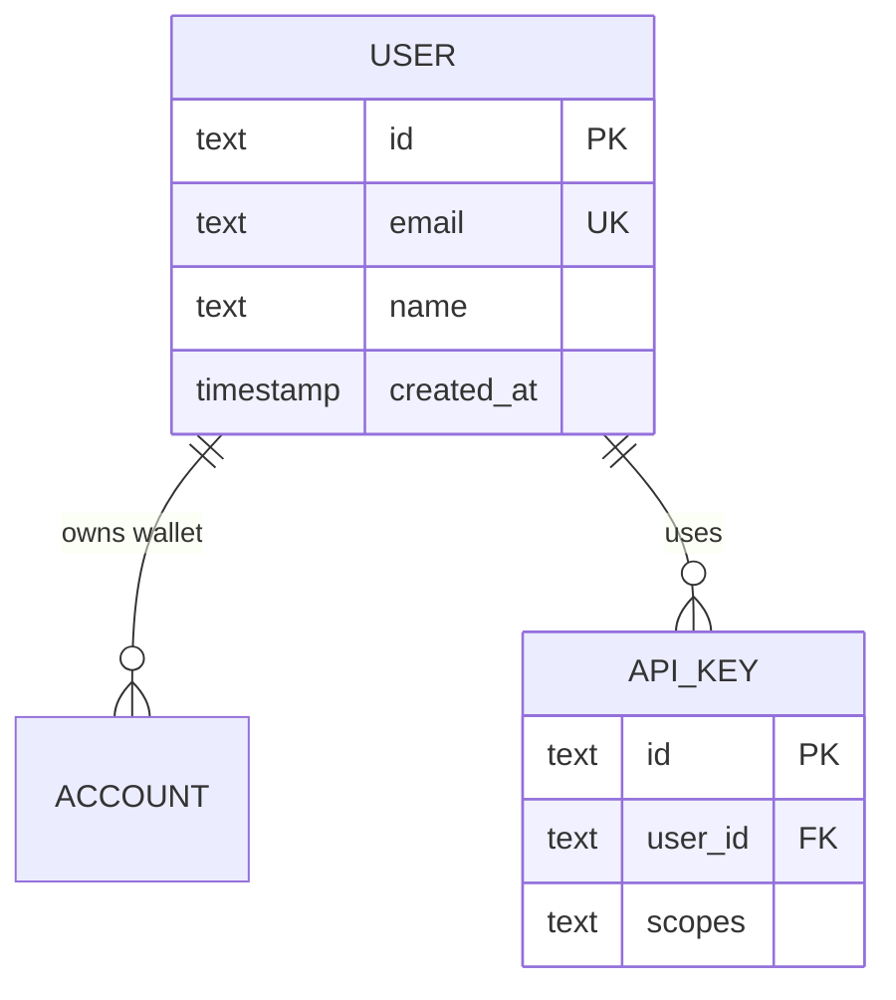

# identity — Accounts

The credibility layer: registers users. In the skeleton this is an
in-memory store; swap in Postgres + hashed credentials + JWT issues for
production.

```
POST /users    register (email, name)
```

## Use case



## Sequence — register



## Activity



## DB schema / ER



```sql
CREATE TABLE app_user (
  id         TEXT PRIMARY KEY,
  email      TEXT UNIQUE NOT NULL,
  name       TEXT NOT NULL,
  created_at TIMESTAMP NOT NULL
);
CREATE TABLE api_key (
  id      TEXT PRIMARY KEY,
  user_id TEXT NOT NULL REFERENCES app_user(id),
  token   TEXT UNIQUE NOT NULL,
  scopes  TEXT NOT NULL
);
```

## Kafka

`identity` publishes `user.registered` on Kafka wiring so onboarding
services (welcome notifications) react without coupling.