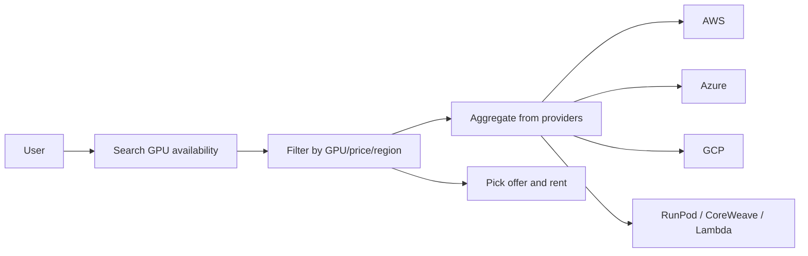
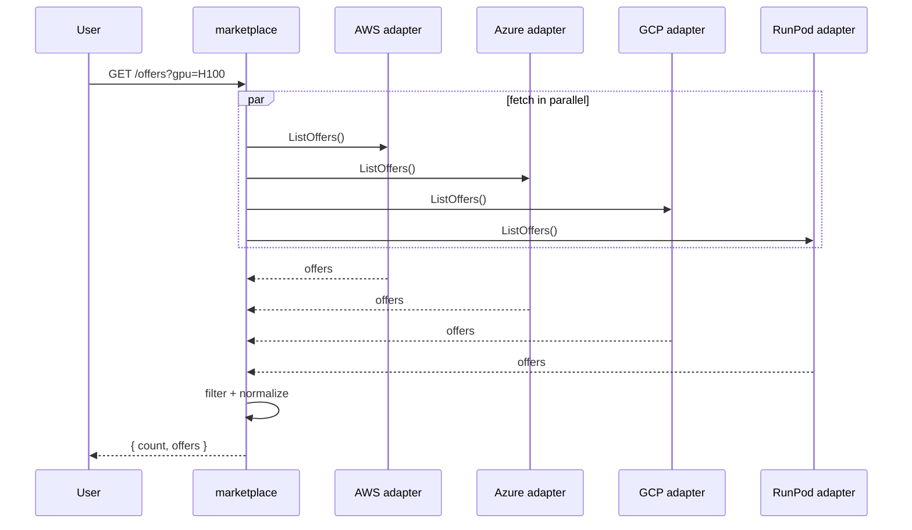
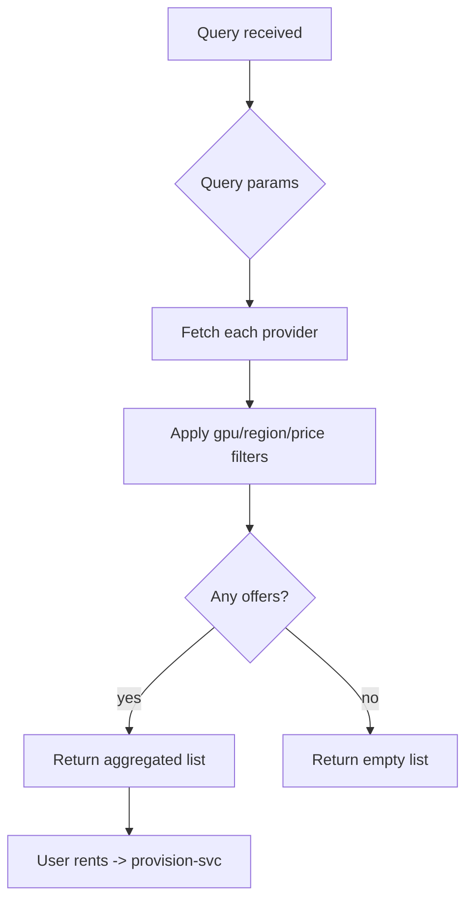
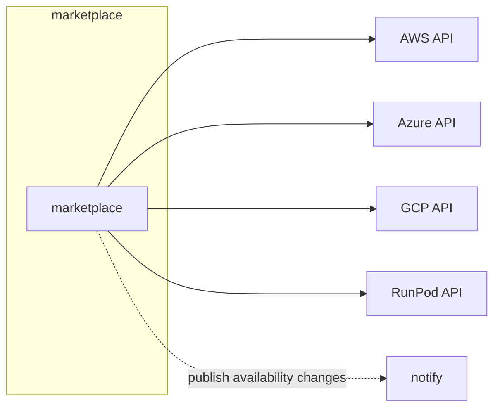
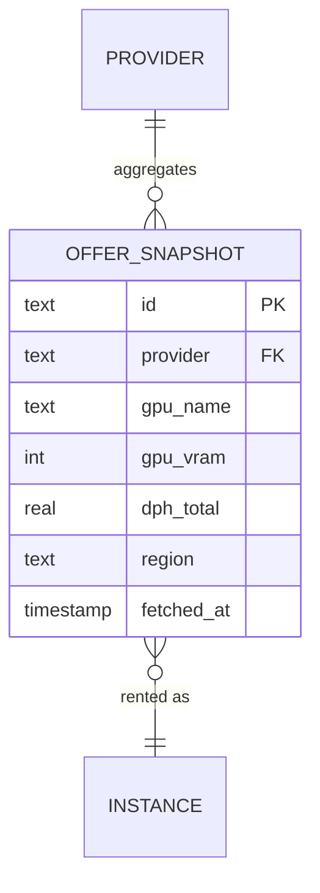

# marketplace — GPU Availability Aggregator

Sources GPU offers from existing cloud providers through adapters and
serves filtered, "in-stock" listings. Every cloud adapter returns the same
`Offer` shape, so new providers drop in behind the same interface.

```
GET /offers?gpu=H100&region=US&max_price=1.5
```

## Use case



## Sequence



## Activity



## Deployment



## DB schema

```sql
CREATE TABLE offer_snapshot (
  id            TEXT PRIMARY KEY,
  provider      TEXT NOT NULL,
  gpu_name      TEXT NOT NULL,
  gpu_vram      INTEGER,
  num_gpus      INTEGER,
  cpu_cores     INTEGER,
  cpu_ram       INTEGER,
  disk_space    REAL,
  dph_total     REAL,
  region        TEXT,
  datacenter    BOOLEAN,
  verified      BOOLEAN,
  reliability2  REAL,
  fetched_at    TIMESTAMP NOT NULL
);
CREATE INDEX idx_offer_gpu ON offer_snapshot(gpu_name, region);
```

## ER diagram



## Kafka

With real adapters, `marketplace` publishes `offers.refreshed` to a Kafka
topic that `provision`/`notify` consume for spot-availability alerts.