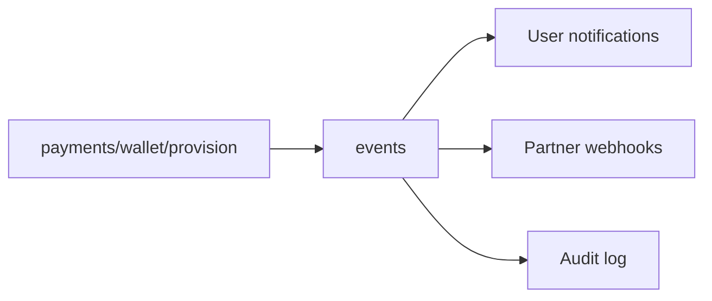
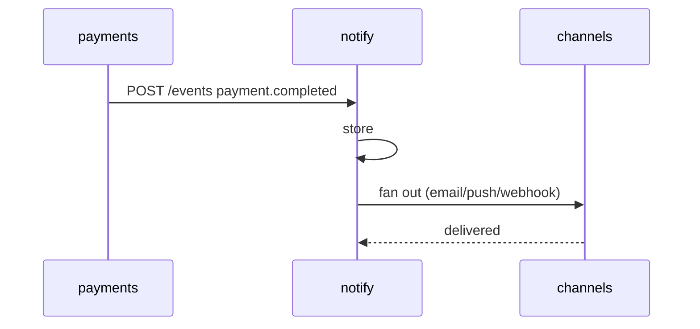
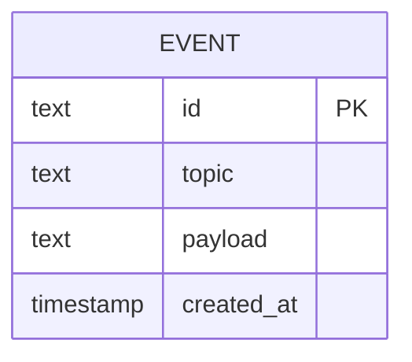

# notify — Event Fan-out / Webhooks

Ingests platform events (as REST webhooks today, Kafka topics later) and is
the hook point for email, push, dashboard feed and partner webhooks.

```
POST /events   ingest a platform event
GET  /events   list recent events
```

## Use case



## Sequence



## DB schema / ER



```sql
CREATE TABLE event (
  id         TEXT PRIMARY KEY,
  topic      TEXT NOT NULL,
  payload    TEXT,
  created_at TIMESTAMP NOT NULL
);
CREATE TABLE webhook_subscriber (
  id       TEXT PRIMARY KEY,
  url      TEXT NOT NULL,
  topics   TEXT NOT NULL
);
```

## Kafka

When Kafka is wired, `notify` becomes a consumer group over `*` topics and
channels are pure sinks — no REST in the middle.