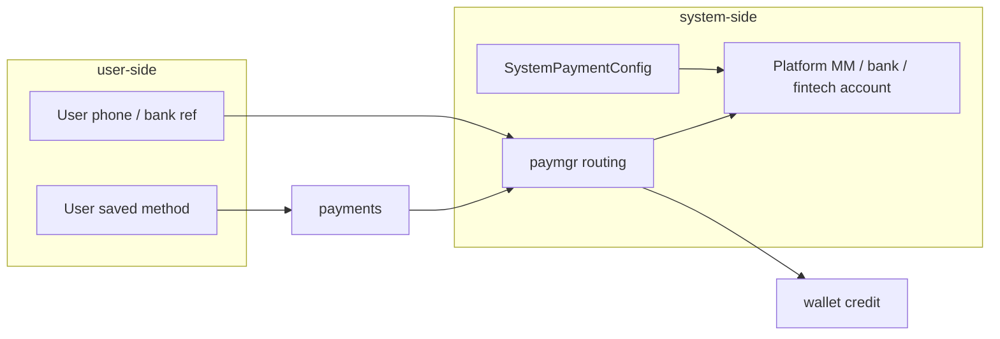

# payments — Top-up Orchestrator

Two sides:

| Side | What | API |
|------|------|-----|
| **User** | Saved payment sources (their MM number, bank ref, fintech) | `GET/POST /payments/users/{id}/methods`, `GET /payments/catalog` |
| **System** | Platform collection accounts (where money lands) | `GET /payments/system/config` |

Top-up flow: user picks a **saved method** → paymgr resolves a **system destination** → routes execution → wallet credited on confirm.

```
GET  /payments/catalog              user-facing payment types
GET  /payments/system/config        platform collection accounts
GET  /payments/users/{userID}/methods
POST /payments/users/{userID}/methods
POST /payments/topup                user method → paymgr → system destination
POST /payments/{id}/confirm
```

## User vs system at top-up



Mobile money USSD uses the **system collection number** in the dial code; the **user phone** is used to match the SIM that enters the code.

## Env

| Variable | Default |
|----------|---------|
| `PAYMENTS_PORT` | 8083 |
| `WALLET_URL` | http://localhost:8082 |
| `PAYMGR_URL` | http://localhost:8089 |
