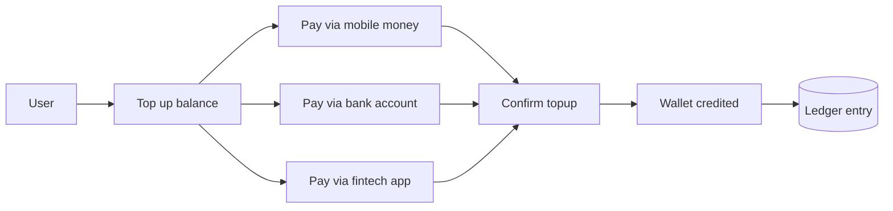
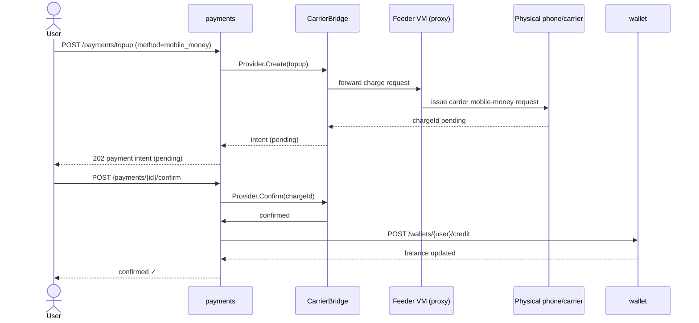
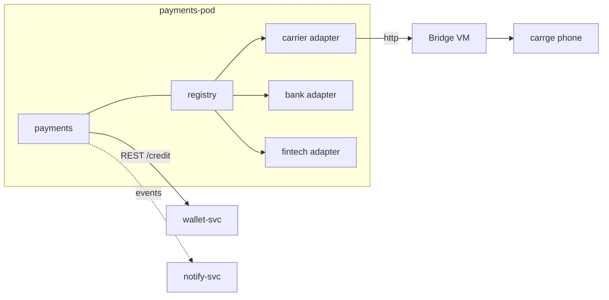
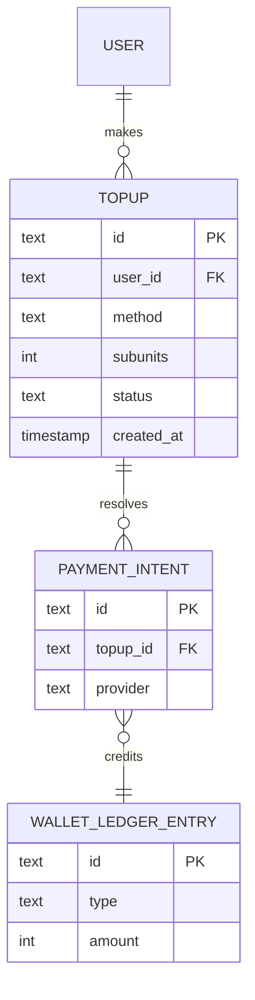

# payments — Top-up Orchestrator

Owns **cash-in** (user top-ups). It exposes one endpoint that fans out to
whichever payment rail the user chose, then credits the wallet once the
rail confirms.

Commands: `go run ./cmd/payments`

```
POST /payments/topup           create a top-up (mobile_money | bank | fintech)
POST /payments/{id}/confirm    resolve the charge → credits wallet
GET  /payments/{id}
```

## Adapters

- **mobile_money** → `MobileMoneyProvider` through a `CarrierBridge`
  (may route through a feeder VM that proxies to the physical machine/phone
  holding the number). Simulated.
- **bank** → global bank account transfer. Simulated.
- **fintech** → third-party fintech app. Simulated.

## Use case



## Sequence — mobile-money top-up (with VM proxy bridge)



## Activity

```mermaid
flowchart TD
  A[Start top-up] --> B{Rail selected?}
  B -->|mobile money| C[Route via CarrierBridge → VM → phone]
  B -->|bank| D[Create bank transfer intent]
  B -->|fintech| E[Create fintech intent]
  C --> F[Store pending topup]
  D --> F
  E --> F
  F --> G[Await confirm]
  G -->|confirmed| H[Credit wallet]
  G -->|failed| I[Mark failed]
  H --> J[Return balance]
  I --> return A[Return error]
  style H fill:#2e7d32,color:#fff
  style I fill:#c62828,color:#fff
```

## Deployment



## DB schema

```sql
CREATE TABLE topup (
  id            TEXT PRIMARY KEY,
  user_id       TEXT NOT NULL,
  method        TEXT NOT NULL,          -- mobile_money | bank | fintech
  subunits      INTEGER NOT NULL,       -- micro-units
  currency      TEXT NOT NULL DEFAULT 'USD',
  provider      TEXT,
  charge_ref    TEXT,
  status        TEXT NOT NULL,           -- pending | confirmed | failed
  created_at    TIMESTAMP NOT NULL,
  completed_at  TIMESTAMP
);
CREATE INDEX idx_topup_user ON topup(user_id, created_at DESC);

CREATE TABLE payment_intent (
  id          TEXT PRIMARY KEY,
  topup_id    TEXT NOT NULL REFERENCES topup(id),
  provider    TEXT NOT NULL,
  raw_payload TEXT
);
```

## ER diagram



## Kafka

On switching to the real rails, `payments` publishes `payment.completed`
(via **Kafka**) that `wallet` consumes to credit balances and `notify` to
fan out. See `internal/shared/events/kafka_bus.go` for the wiring step.