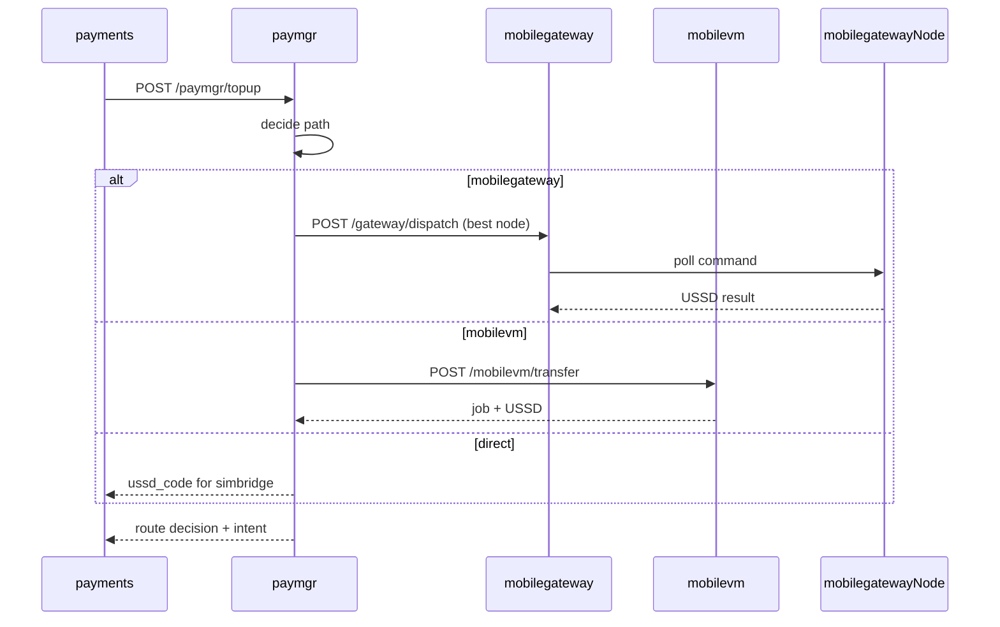

# paymgr — Backend Payment Manager

Decides **where each top-up actually moves**: mobile money provider,
bank, or fintech — and which execution path to use.

Commands: `go run ./cmd/paymgr`

```
GET  /paymgr/system/config        platform collection accounts
POST /paymgr/route              dry-run routing decision
POST /paymgr/topup              route + kick off execution
GET  /paymgr/nodes/live         scan live mobilegateway nodes
POST /paymgr/topup/{id}/refund  dispatch refund to capable node
GET  /paymgr/topup/{id}
```

## Routing paths

Every top-up resolves a **system destination** from `SystemPaymentConfig` before choosing a path.

| Path | When |
|------|------|
| `mobilegateway` | Live physical SIM node available — load-balanced by pending jobs + latency |
| `mobilevm` | Cross-rail: number→number, fintech→bank, bank→mobilemoney, special carrier dial-up |
| `direct` | No live nodes — user device USSD via local simbridge |
| `bank` / `fintech` | Direct rail, no VM hop |

## Sequence



## Load balancing

paymgr scans `GET /gateway/nodes/live` and picks the node with:
1. Matching SIM (phone suffix or carrier)
2. Lowest `pending_jobs`
3. Lowest `latency_ms`

Used for top-ups, refunds, and bottleneck avoidance.

## Env

| Variable | Default |
|----------|---------|
| `PAYMGR_PORT` | 8089 |
| `MOBILE_GATEWAY_URL` | http://localhost:8091 |
| `MOBILE_VM_URL` | http://localhost:8090 |
