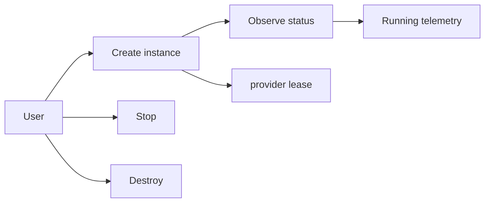
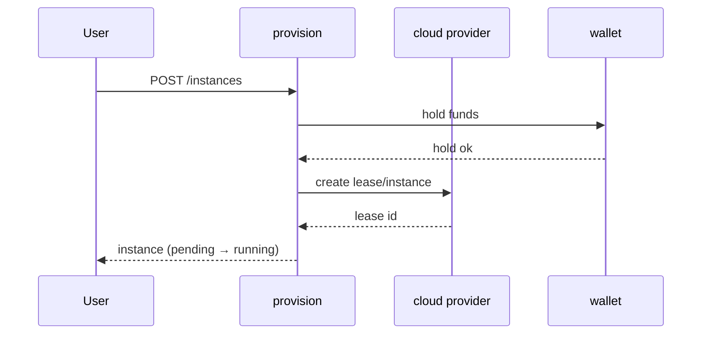
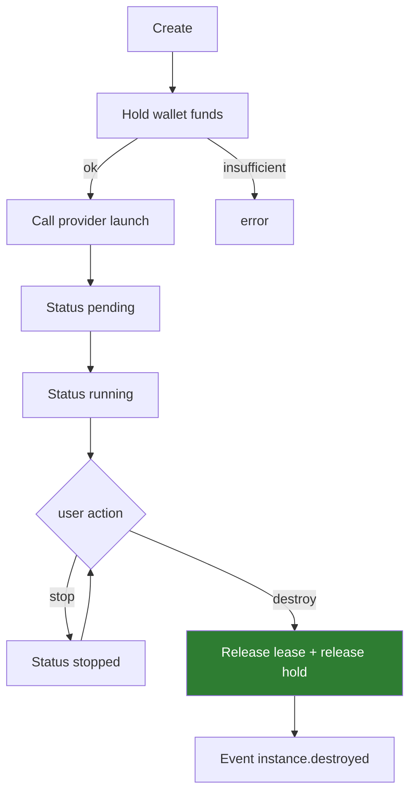
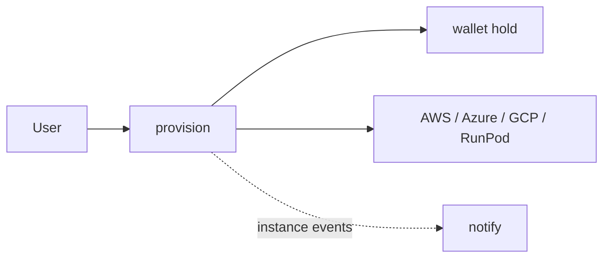
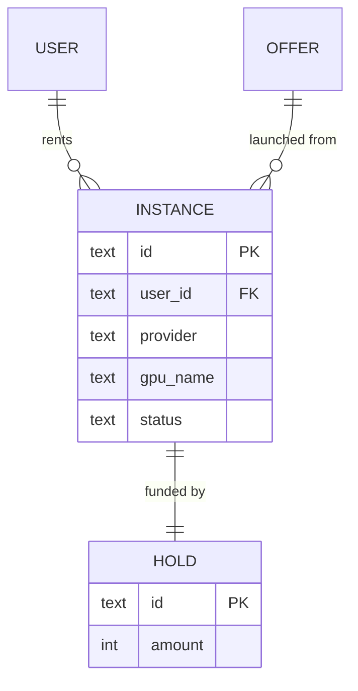

# provision — Instance Lifecycle

Creates, observes and destroys rented GPU instances on the cloud provider
behind the marketplace. In the skeleton, launches are simulated.

```
POST /instances        launch (user_id, gpu_name, num_gpus, provider)
GET  /instances        list
```

## Use case



## Sequence — launch



## Activity



## Deployment



## DB schema

```sql
CREATE TABLE instance (
  id         TEXT PRIMARY KEY,
  user_id    TEXT NOT NULL,
  offer_id   TEXT,
  provider   TEXT NOT NULL,
  gpu_name   TEXT NOT NULL,
  num_gpus   INTEGER,
  dph_total  REAL,
  ssh_host   TEXT,
  ssh_port   INTEGER,
  status     TEXT NOT NULL,   -- pending | running | stopped | destroyed
  created_at TIMESTAMP NOT NULL
);
CREATE INDEX idx_instance_user ON instance(user_id);
```

## ER diagram



## Kafka

On Kafka wiring, `provision` publishes `instance.provisioned` and
`instance.destroyed`; `settlement` consumes them to meter and bill usage,
and `notify` to alert the user.