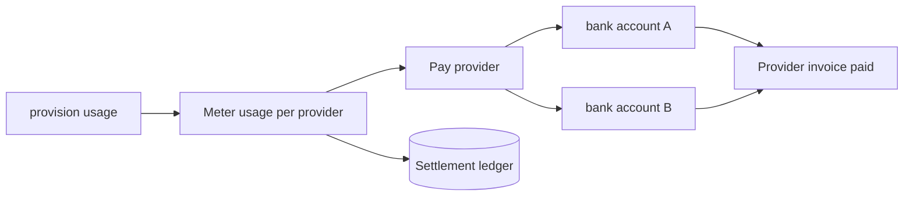
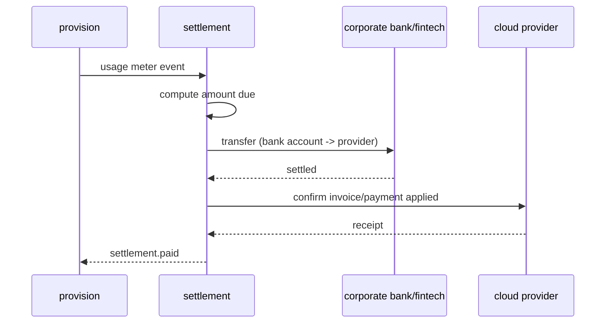
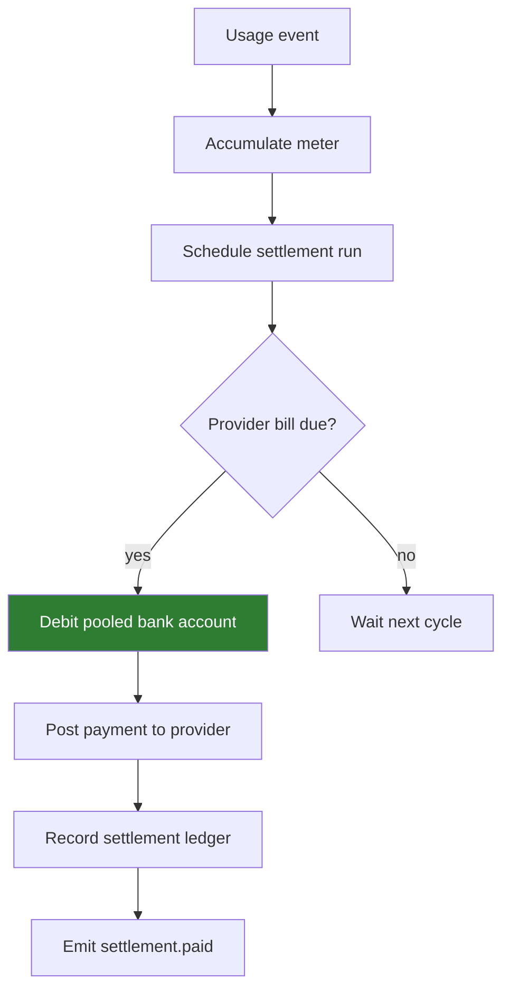
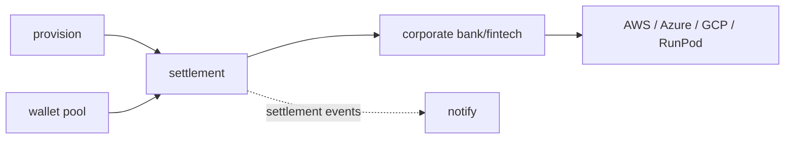
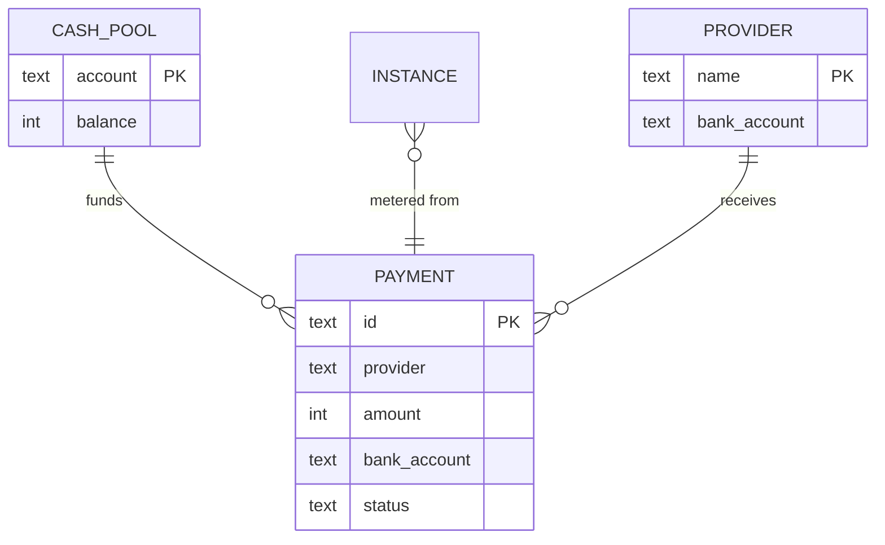

# settlement — Pay the Cloud Provider (money-out)

The counterpart to top-ups: user credits pool into our corporate
bank/fintech account; `settlement` pays each cloud provider from a specific
bank account for the underlying resource usage, on a metered schedule.
Simulated in the skeleton.

```
POST /settlements     pay provider (user_id, provider, amount, bank_account)
GET  /settlements
```

## Use case



## Sequence



## Activity



## Deployment



## DB schema

```sql
CREATE TABLE payment (
  id           TEXT PRIMARY KEY,
  user_id      TEXT NOT NULL,
  provider     TEXT NOT NULL,
  amount       INTEGER NOT NULL,      -- micro-units
  currency     TEXT NOT NULL DEFAULT 'USD',
  bank_account TEXT NOT NULL,
  status       TEXT NOT NULL,          -- reserved | paid | failed
  created_at   TIMESTAMP NOT NULL
);
CREATE INDEX idx_payment_provider ON payment(provider, created_at);

CREATE TABLE cash_pool (
  account TEXT PRIMARY KEY,
  balance INTEGER NOT NULL
);
```

## ER diagram



## Kafka

On Kafka wiring, `settlement` consumes `instance.provisioned/destroyed`
metering events and publishes `settlement.paid` for finance audit + notify.