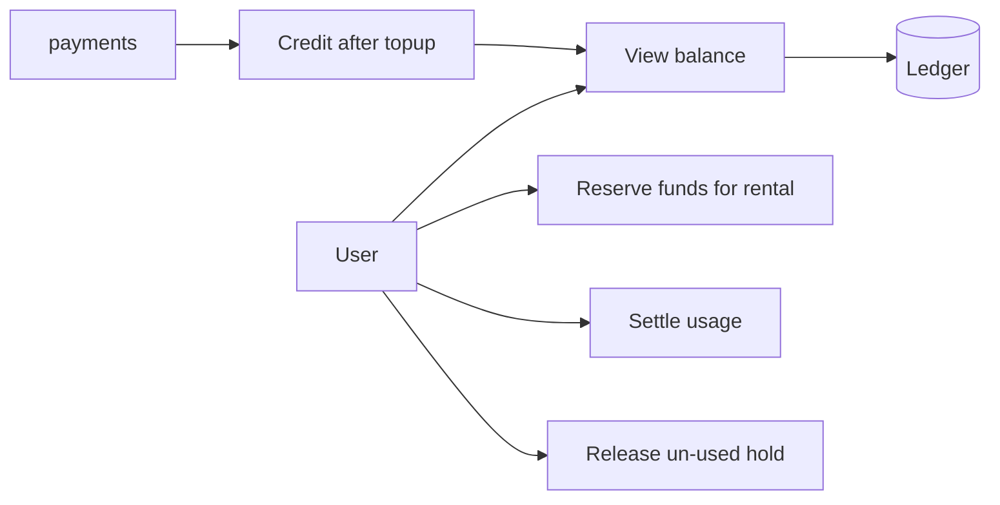
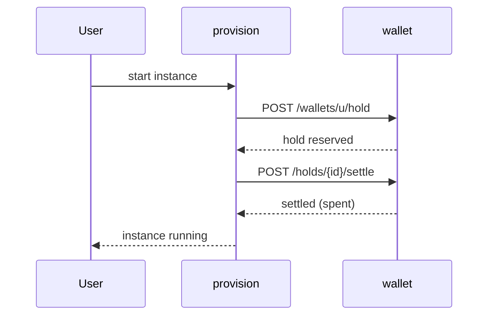
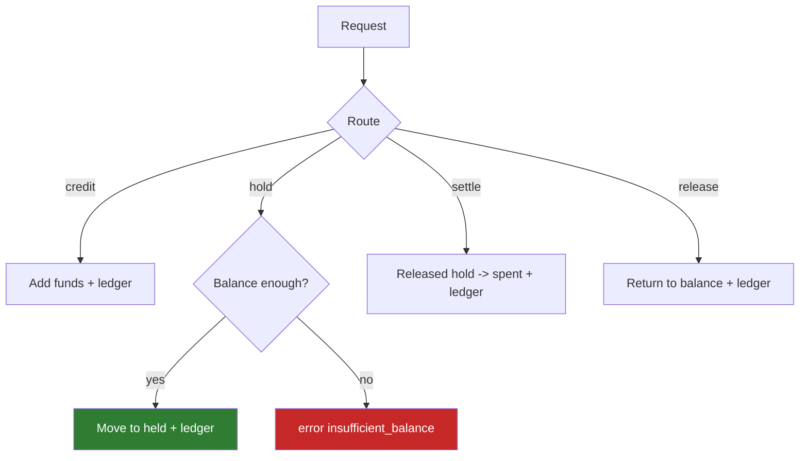
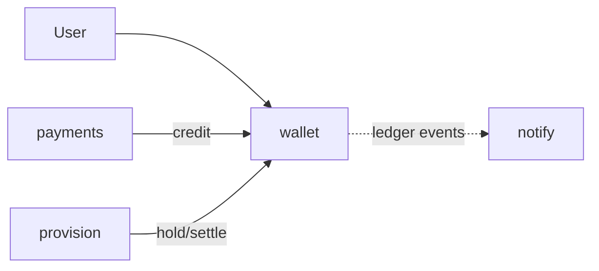
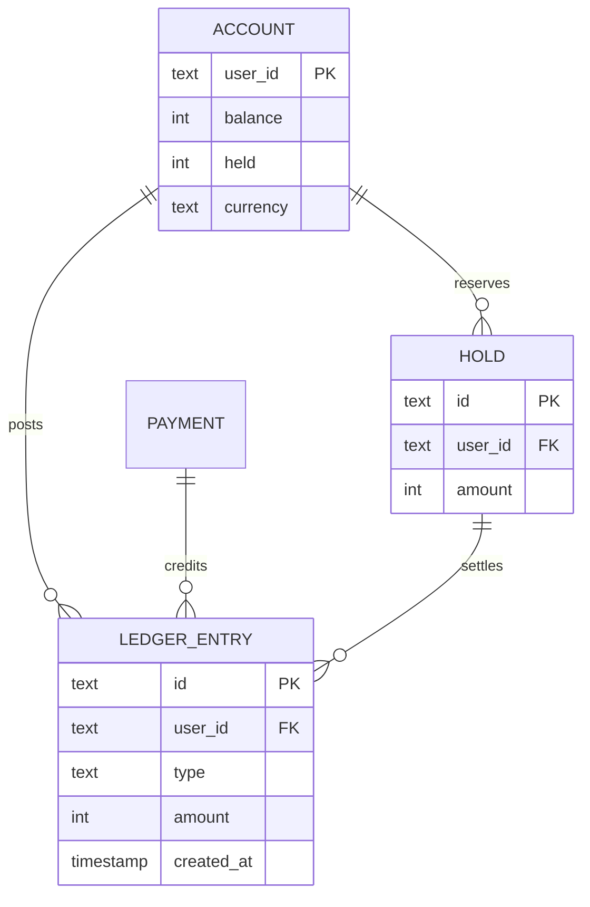

# wallet — Balances, Holds & Ledger

Single source of truth for user money. Balances are integer micro-units
(via `internal/shared/money`). Movements are recorded to an immutable ledger.

```
GET  /wallets/{user}               balance
POST /wallets/{user}/credit        top-up/cash-in credit
POST /wallets/{user}/hold          reserve funds (rental)
POST /wallets/holds/{hold}/settle  charge a held amount
POST /wallets/holds/{hold}/release return a hold
GET  /wallets/{user}/ledger        history
```

## Use case



## Sequence — rental hold/settle



## Activity



## Deployment



## DB schema

```sql
CREATE TABLE account (
  user_id    TEXT PRIMARY KEY,
  balance    INTEGER NOT NULL,   -- micro-units
  held       INTEGER NOT NULL,
  currency   TEXT NOT NULL DEFAULT 'USD',
  updated_at TIMESTAMP NOT NULL
);

CREATE TABLE ledger_entry (
  id         TEXT PRIMARY KEY,
  user_id    TEXT NOT NULL REFERENCES account(user_id),
  type       TEXT NOT NULL,       -- credit | hold | release | settle
  amount     INTEGER NOT NULL,
  reference  TEXT,
  created_at TIMESTAMP NOT NULL
);
CREATE INDEX idx_ledger_user ON ledger_entry(user_id, created_at);

CREATE TABLE hold (
  id         TEXT PRIMARY KEY,
  user_id    TEXT NOT NULL,
  amount     INTEGER NOT NULL,
  reference  TEXT,
  created_at TIMESTAMP NOT NULL
);
```

## ER diagram



## Kafka

`wallet` is the **credit ledger**; it consumes `payment.completed` and, on
new Kafka wiring, publishes `wallet.credited/debited` for `notify` and audit.